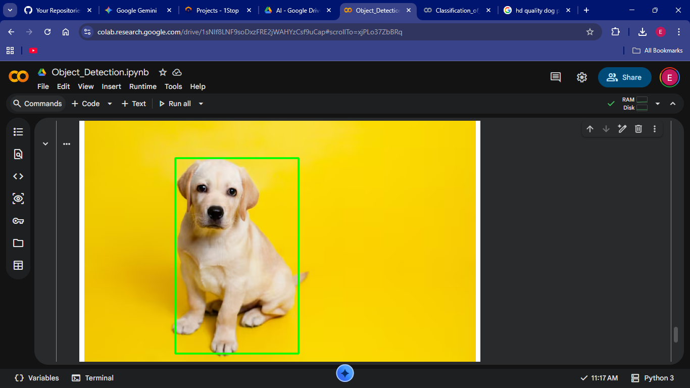

# 🧠 Object Detection using TensorFlow (SSD MobileNet)

## 📌 Overview
This project implements an end-to-end object detection system using a pre-trained **SSD MobileNet V2** model from TensorFlow Hub.  
The system takes an input image, performs inference, and outputs bounding boxes with predicted class labels and confidence scores.

The model is trained on the **COCO dataset**, which contains 80 real-world object categories such as person, car, dog, chair, laptop, and more.

---

## 🚀 Key Features
- Detects multiple objects in a single image
- Displays bounding boxes with class labels
- Shows confidence scores for each detection
- Applies confidence threshold filtering
- Clean visualization using OpenCV and Matplotlib
- Implemented and tested in Google Colab

---

## 🛠️ Tech Stack
- **Python**
- **TensorFlow**
- **TensorFlow Hub**
- **OpenCV**
- **NumPy**
- **Matplotlib**

---

## 🏗️ Project Architecture

Input Image
↓
Image Preprocessing (Resize + RGB Conversion)
↓
Tensor Conversion
↓
SSD MobileNet V2 (TensorFlow Hub)
↓
Bounding Boxes + Class Predictions + Confidence Scores
↓
Visualization Output


---

## 📸 Sample Output



---

## ⚙️ How It Works

1. Upload an image.
2. Convert image into RGB format.
3. Transform image into a TensorFlow tensor.
4. Pass tensor to the SSD MobileNet model.
5. Extract:
   - Detection boxes
   - Class IDs
   - Confidence scores
6. Draw bounding boxes and labels on detected objects.
7. Display the final processed image.

---

## 🔮 Future Improvements
- Real-time webcam object detection
- Object tracking across video frames
- Deployment using Streamlit or Flask
- Model optimization with TensorFlow Lite
- Custom dataset fine-tuning

---

## ▶️ How to Run

### 1️⃣ Install dependencies
```bash
pip install -r requirements.txt

2️⃣ Run the notebook

🧾 Conclusion

This project demonstrates practical implementation of computer vision using deep learning.
It showcases model inference, tensor processing, bounding box computation, class mapping, and result visualization in a structured pipeline.

The project highlights strong understanding of TensorFlow-based object detection workflows and real-world AI application development.


